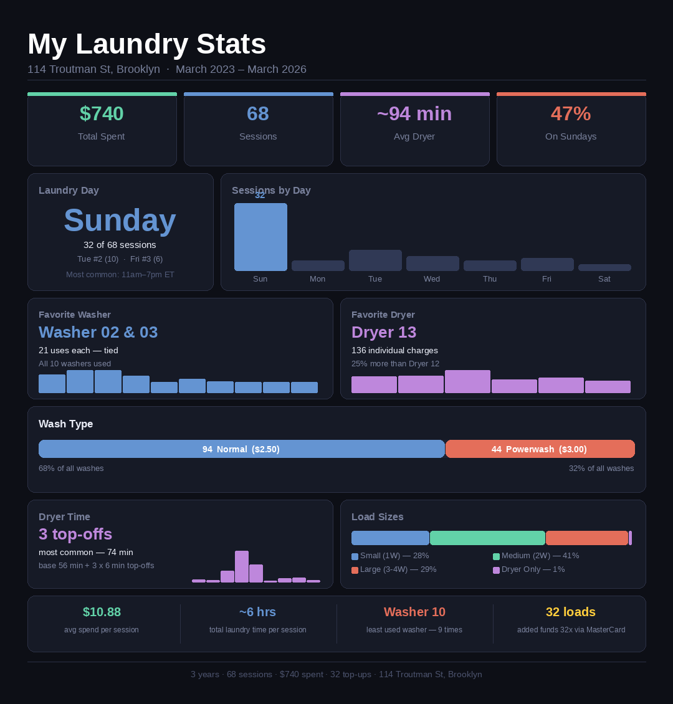

# 🧺 Laundry Dashboard

An interactive data dashboard built from 3 years of personal laundry transaction history at 114 Troutman St, Brooklyn (March 2023 – March 2026).

**[→ Live Demo](https://brooklyn-laundry-dashboard.vercel.app/)**



## Overview

The building's laundry machines log every transaction to a CSV export. I took that raw data and built a fully self-contained, interactive dashboard to analyze my own habits — what days I do laundry, which machines I favor, how I split loads, and how long my dryer runs typically are.

No backend, no build step. Open the HTML file in any browser and it works.

## Features

- **Total spend tracker** — Sums all "Added Funds" transactions to show true spend over time
- **Day × Hour heatmap** — Interactive grid showing which day/time combos I actually use
- **Day of week & time-of-day bar charts** — Visual breakdown of session frequency
- **Washer usage** — Tracks all 10 washers, identifies favorites, distinguishes normal ($2.50) from powerwash ($3.00) cycles
- **Dryer usage** — Tracks all 6 dryers (including Stack Dryer 14), breaks down top-off frequency per session, calculates average dryer time
- **Load size classification** — Groups sessions by number of washers used (Small = 1, Medium = 2, Large = 3–4)
- **Searchable session log** — Full table of all 68 sessions, filterable by load size and searchable by date, machine, or day
- **Shareable summary graphic** — A standalone PNG infographic of the key stats (`laundry_stats.png`)

## Key Findings

| Stat | Value |
|---|---|
| Total added to laundry card | **$740** across 32 top-ups |
| Total sessions | **68** (~1.7/month) |
| Favorite day | **Sunday** (47% of all sessions) |
| Favorite washer | **Washer 02 & 03** (tied at 21 uses) |
| Favorite dryer | **Dryer 13** (136 individual charges) |
| Most common load | **Medium** — 2 washers (41% of sessions) |
| Normal vs. powerwash | **94 normal**, 44 powerwash |
| Average dryer time | **~94 minutes** per machine per session |
| Most common top-off pattern | **3 top-offs** → 74 min (47 sessions) |

## Data Notes

- All times are converted to **Eastern Time** (the source data is in PDT/PST)
- A "session" is defined as all machine charges within a 3-hour window
- Dryer time is estimated: $1.75 base = 56 min, each $0.25 top-off = +6 min
- The CSV is included for reference, but the dashboard is fully self-contained — all data is pre-processed and embedded in the HTML

## Files

```
index.html                — interactive dashboard (open in any browser)
laundry_stats.png         — shareable summary infographic
UserTransactionList.csv   — raw transaction export from the laundry app
```

## Tech Stack

- Vanilla HTML/CSS/JavaScript — zero dependencies, no build step
- [Chart.js](https://www.chartjs.org/) (CDN) — bar charts, doughnut charts
- Python (Pillow/PIL) — used offline to generate the summary PNG
- Data parsed and pre-processed with Python (`csv`, `datetime`, `collections`)
